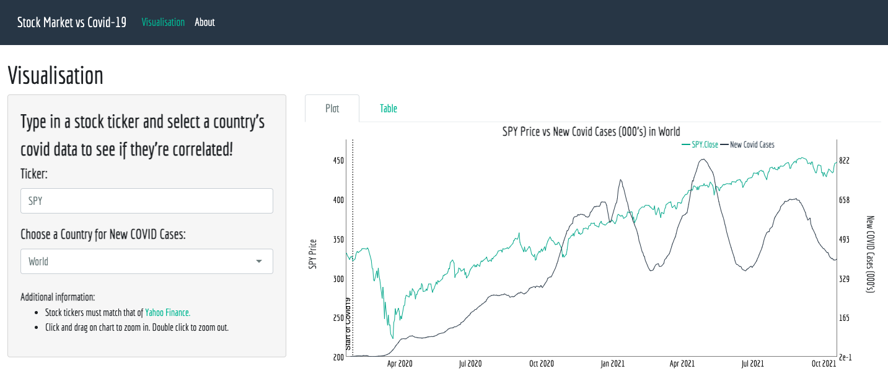

## Stock Market vs COVID-19 Interactive Visualisation Tool
This github page contains the code and input data for the [Stock Market vs COVID-19 interactive visualisation tool](https://weijieesim.shinyapps.io/Stock_Market_vs_Covid19/).

Covid19 input data are obtained from [Our World in Data](https://github.com/owid/covid-19-data/tree/master/public/data); stock market data is obtained from [Yahoo Finance](https://sg.finance.yahoo.com/)

## Shiny Interface

Follow this [link](https://weijieesim.shinyapps.io/Stock_Market_vs_Covid19/) for the Shiny app. A screenshot of the interface is as shown below.

## Contact
[Portfolio Website](https://weijiesim.github.io/#)

wjsim00@gmail.com
